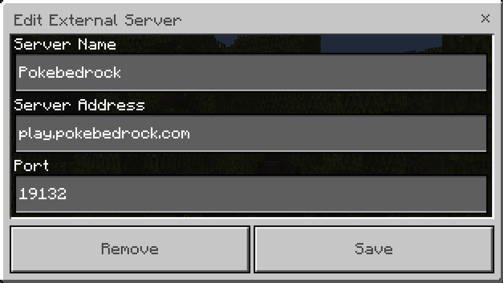

## How to Join Pokébedrock :thinking:

### Step 1: Open Minecraft
Launch Minecraft on your device. Make sure you have the Bedrock Edition of Minecraft installed.

### Step 2: Navigate to the Servers Tab
Once Minecraft is open, you'll see the main menu. Tap or click on the "Play" button.

### Step 3: Add a New Server
In the "Play" menu, select the "Servers" tab. Then, click on the "Add Server" button.

### Step 4: Enter Server Information
Now it's time to enter the server details:
- **Server Name:** Pokébedrock
- **IP Address:** play.pokebedrock.com
- **Port:** 19132

### Step 5: Save and Join
After entering the server information, click or tap on the "Save" button. Once saved, you'll see the Pokébedrock server listed in your server list. Click or tap on it to join the adventure!

### Step 6: Explore and Have Fun!
Congratulations! You're now part of the Pokébedrock community. Explore the vast world, build amazing structures, and catch Pokémon to your heart's content. Remember to follow the rules and be respectful to other players.

### Tips for New Trainers:
- **Start Small:** Don't feel overwhelmed! Start with simple builds and gradually work your way up.
- **Ask for Help:** If you're stuck or have questions, don't hesitate to ask other players or staff members for assistance.
- **Be Kind:** Pokébedrock is a friendly community. Treat others with kindness and respect.

### Get Ready for Adventure!
Now that you know how to join Pokébedrock, it's time to dive into the world of Minecraft and Pokémon! Get your tools ready, train your Pokémon, and let the adventure begin! 🚀

If you have any questions or need further assistance, feel free to ask in the chat. Happy gaming! 🎉